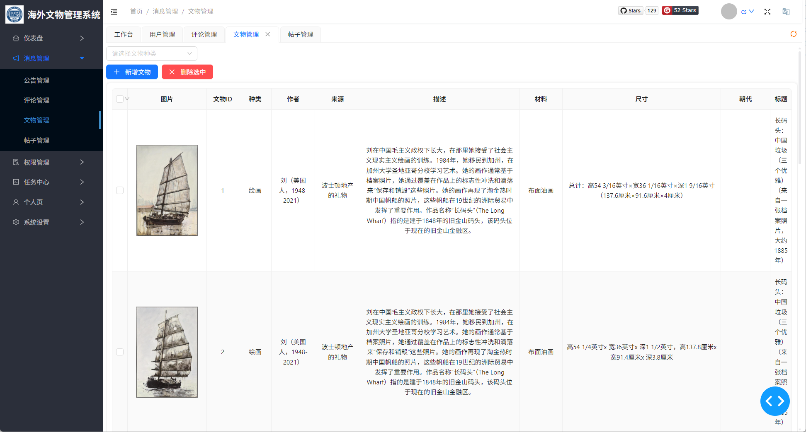
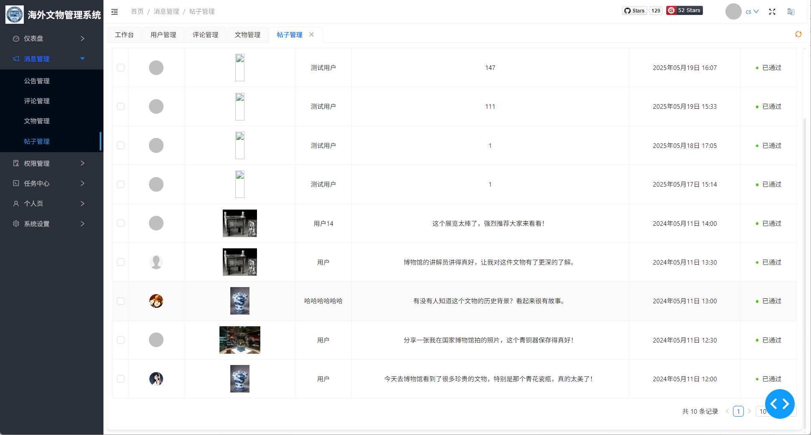
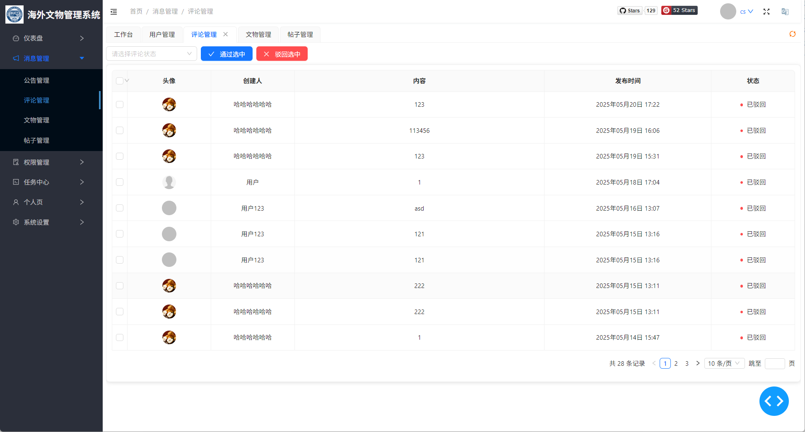
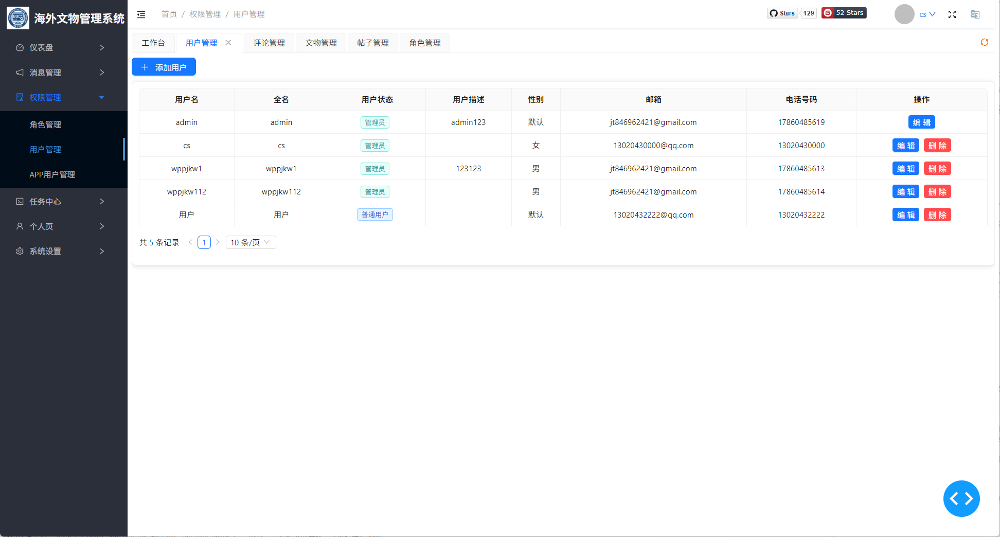
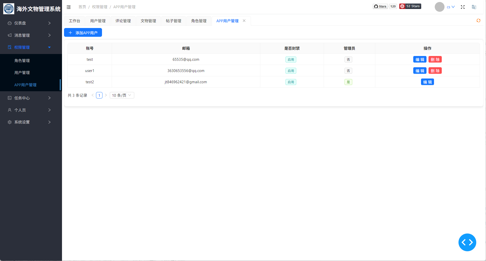

<p align="center">
	
</p>
<h1 align="center" style="margin: 30px 0 30px; font-weight: bold;">Team5-海外文物后台管理系统</h1>

## 一、简介
本仓库是第五组开发的海外文物后台管理系统仓库

基于Plotly Dash框架和Fac开源组件库开发
### 功能:
1. 用户管理
   - 新增、删除用户
   - 用户权限管理
   - APP端用户管理
2. 评论系统管理
    - 对于针对文物的评论，进行审核和通过操作
    - 对于APP端的帖子（Post）进行审核和撤销
3. 文物管理
    - 对于现有文物库存进行查找、查阅（实现了图片等的预览）
    - 对于文物进行入库、出库操作
    - 实现了根据文物的种类对文物进行管理

### 技术栈
#### 前端技术
1. **Plotly Dash** - 核心Web应用框架

   - 基于React.js和Flask的Python Web应用框架
   - 专为数据分析和可视化应用设计
2. **Feffery组件生态系统**

   - Feffery Antd Components (fac) - 基于Ant Design的UI组件库
   - Feffery Antd Charts (fact) - 数据可视化图表组件
   - Feffery Utils Components (fuc) - 工具类组件
   - Feffery Dash Utils - Dash扩展工具库
3. **JavaScript** - 用于浏览器回调和预加载功能

#### 后端技术
1. **Python** - 主要开发语言

2. **ORM和数据库**

   - **Peewee ORM** - 轻量级Python ORM框架，用于数据库操作
   - 关系型数据库MySQL
3. **Web服务器**

   - Windows环境: Waitress - 纯Python WSGI服务器
   - Linux环境: Gunicorn - Python WSGI HTTP服务器

4. **项目架构**

   - 类MVC架构模式
   - 回调机制实现前后端交互

------

## 二、项目结构

```
├─assets                # 静态资源目录
│  ├─imgs                  # 图片资源
│  └─js                    # js文件资源（dash框架预加载js文件、浏览器回调js等）
├─common                # Python共享功能库
│  └─utilities          # Python工具类
├─config                # 项目配置目录
├─dash_callback         # Dash回调库
│  ├─application
│  │  ├─access_
│  │  ├─dashboard_
│  │  └─person_
│  └─pages
├─dash_components       # Dash自定义组件
├─dash_view             # Dash视图
│  ├─application           # 应用视图
│  │  ├─access_
│  │  ├─dashboard_
│  │  ├─notification_
│  │  ├─task_
│  │  └─person_
│  ├─framework
│  └─pages
└─database              # 数据库
   └─sql_db               # 关系型数据库配置
       ├─dao                # 数据库orm抽象
       └─entity             # 数据库表实体

```

------


## 三、启动平台

1. windows用户根据requirements_win.txt，linux用户根据requirements_linux.txt 安装Python依赖

   > 安装依赖命令： python -m pip install -r requirements_xxx.txt


2. 切换工作区到src目录

   > windows:     cd /d e:\xxxx
   >
   > linux:            cd /app/xxxx

3. 执行python app.py，即可启动Dash debugger调试模式，根据日志提示中的URL进行访问

   > 生产环境（非debugger）启动命令：
   >
   > - **Windows**：   waitress-serve --host=0.0.0.0 --port=8090 --url-scheme=http --trusted-proxy=* --trusted-proxy-headers=x-forwarded-for --threads=8 app:server
   > - **Linux**:            gunicorn --capture-output -w 4 -b 0.0.0.0:8090 app:server
   >
   > `默认账号`：admin、密码：admin123


------

## 四、各模块截图介绍






